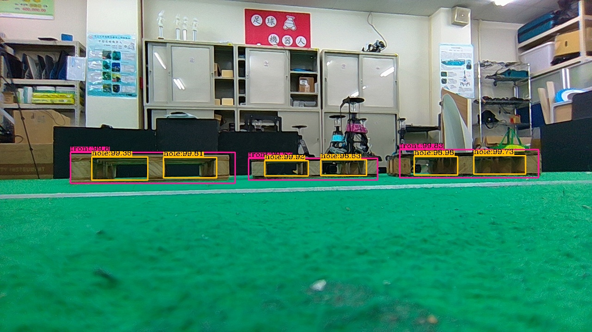
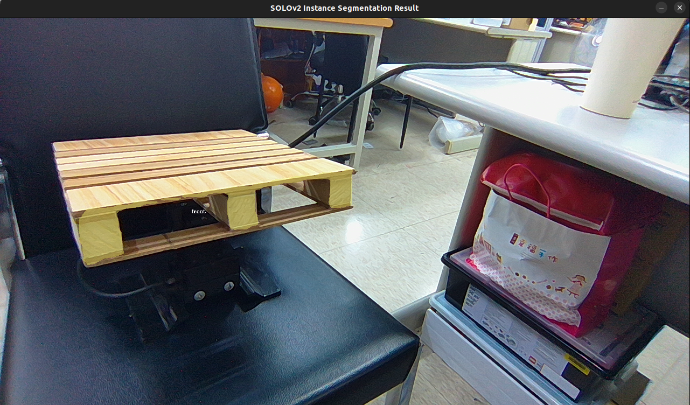
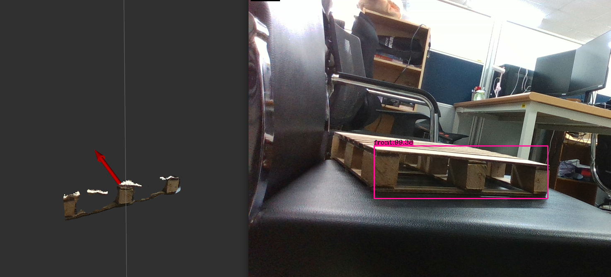
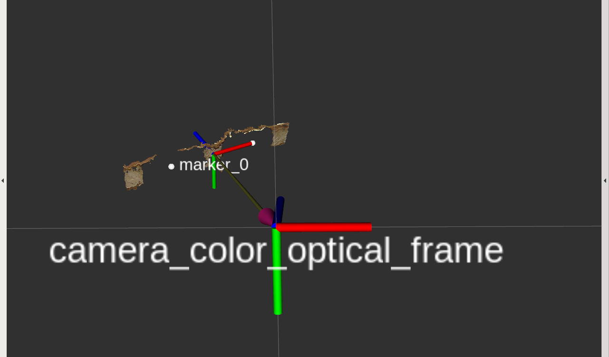
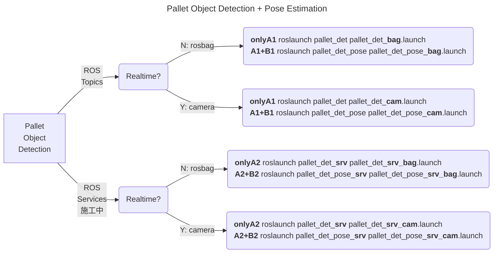
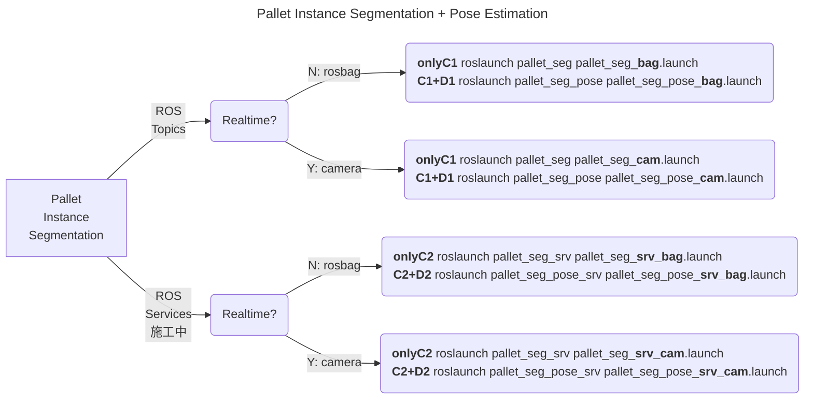

# pallet_det_seg


<div align="center"> 
    
| <div style="width:500px">托盤物件偵測 <br> Pallet object detection</div> | <div style="width:500px">托盤實例分割 <br> Pallet object detection</div> | 
| :----: | :----: | 
|   |   |
| <div style="width:500px">**基於物件偵測之托盤點雲提取+姿態估測<br>Pallet point cloud extraction & pose estimation<br>based on object detection**</div> | <div style="width:500px">**基於實例分割之托盤點雲提取+姿態估測<br>Pallet point cloud extraction & pose estimation<br>based on instance segmentation**</div> | 
|   |   |
    
</div>

## Table of content
- [RGB-D Camera](#rgb-d-camera)
- [Installation and Run with Docker](#installation-and-run-with-docker)
- [Pallet Object Detection](#pallet-object-detection)
- [Pallet Instance Segmentation](#pallet-instance-segmentation)

## RGB-D Camera
* [Realsense D435i](https://www.intelrealsense.com/depth-camera-d435i)
    <details>
    <summary>Modify Dockerfile for Realsense D435i</summary>
        - [ ] How to modify dockerfile
    </details>

* [Altek 3D UVC](https://store.altek.com.tw/sites/default/downloads/al3d/altek_3D_UVC_Camera_Product_Specification_20220107.pdf)  
    <details>
    <summary>Modify Dockerfile for Altek 3D UVC</summary>
        * silver_camera: Altek_3D_Camera SDK (v2.49.0 tag:unknown)
        * black_camera: Altek_3D_Camera SDK (v2.49.0 tag:v67)
        - [ ] How to modify dockerfile
    </details>

## Installation and Run with Docker
```
mkdir pallet_det_seg_ws
git clone --recursive https://github.com/AndersonYu7/pallet_det_seg.git src
cd pallet_det_seg_ws/src/docker && ./build.sh

！！！相機先連接主機 再執行 不然會找不到相機
./run.sh
```
inside docker container
```
# install mmdetection
cd ~/work/src/mmdetection2
pip3 install -v -e .

# compile darknet (YOLOv4)
cd ~/work/src/darknet_new
make

# build project
cd ~/work
catkin_make
. devel/setup.bash

# USB port
sudo chmod 777 /dev/video0
```

## Pallet Object Detection
### Function Modules
| # | <div style="width:500px">Name</div> | rospkg name | Description |
| :----: | :----: | :----: | :----: |
| **A1** <br> ROS Topic | 托盤物件偵測 <br> Pallet object detection | pallet_det | Detect wood pallets bounding boxes from RGB image |
| **B1** <br> ROS Topic | 托盤點雲提取+姿態估測 <br> Pallet point cloud extraction <br>& pose estimation | pallet_det_pose | Extract 3D points relative to pallet bounding boxes' pixels<br>from organized point cloud and estimate pallet's pose |
| **A2** <br> ROS Service | 托盤物件偵測 <br> Pallet object detection | pallet_det_srv | Detect wood pallets bounding boxes from RGB image |
| **B2** <br> ROS Service | 托盤點雲提取+姿態估測 <br> Pallet point cloud extraction <br>& pose estimation | pallet_det_pose_srv | Extract 3D points relative to pallet bounding boxes' pixels<br>from organized point cloud and estimate pallet's pose |

### 下載pallet YOLOv4權重檔
* YOLOv4
* config:
* weights

### 程式執行

Realtime?  * [N: rosbag] --> 使用預錄ROSBag, [Y: camera] --> 使用即時相機資訊

## Pallet Instance Segmentation
### Function Modules
| # | <div style="width:500px">Name</div> | rospkg name | Description |
| :----: | :----: | :----: | :----: |
| **C1** <br> ROS Topic | 托盤實例分割 <br> Pallet instance segmentation | pallet_seg | Detect and perform instance segmentation of wood pallets instance masks<br>from RGB image |
| **D1** <br> ROS Topic | 托盤點雲提取+姿態估測 <br> Pallet point cloud extraction <br>& pose estimation | pallet_seg_pose | Extract 3D points relative to DLO instance mask pixels<br>from organized point cloud and estimate pallet's pose |
| **C2** <br> ROS Service | 托盤實例分割 <br> Pallet instance segmentation | pallet_seg_srv | Detect and perform instance segmentation of wood pallets instance masks <br>from RGB image |
| **D2** <br> ROS Service | 托盤點雲提取+姿態估測 <br> Pallet point cloud extraction <br>& pose estimation | pallet_seg_pose_srv | Extract 3D points relative to DLO instance mask pixels<br>from organized point cloud and estimate pallet's pose |

### 下載pallet SOLOv2權重檔
* SOlOv2 with [mmdetection2](https://github.com/open-mmlab/mmdetection)
* config: ./mmdetection2/configs/solov2/pallet_test_2.py  
* weights: pallet.pth  
(把權重檔放在~/work/src/mmdetection2/work_dirs/pallet.pth)
```
# inside docker container
cd ~/work/src/mmdetection2/
mkdir work_dirs

# copy weight into docker container
docker cp pallet.pth 896ac4d402bb:/home/iclab/work/src/mmdetection2/work_dirs
```

### 程式執行

Realtime?  * [N: rosbag] --> 使用預錄ROSBag, [Y: camera] --> 使用即時相機資訊