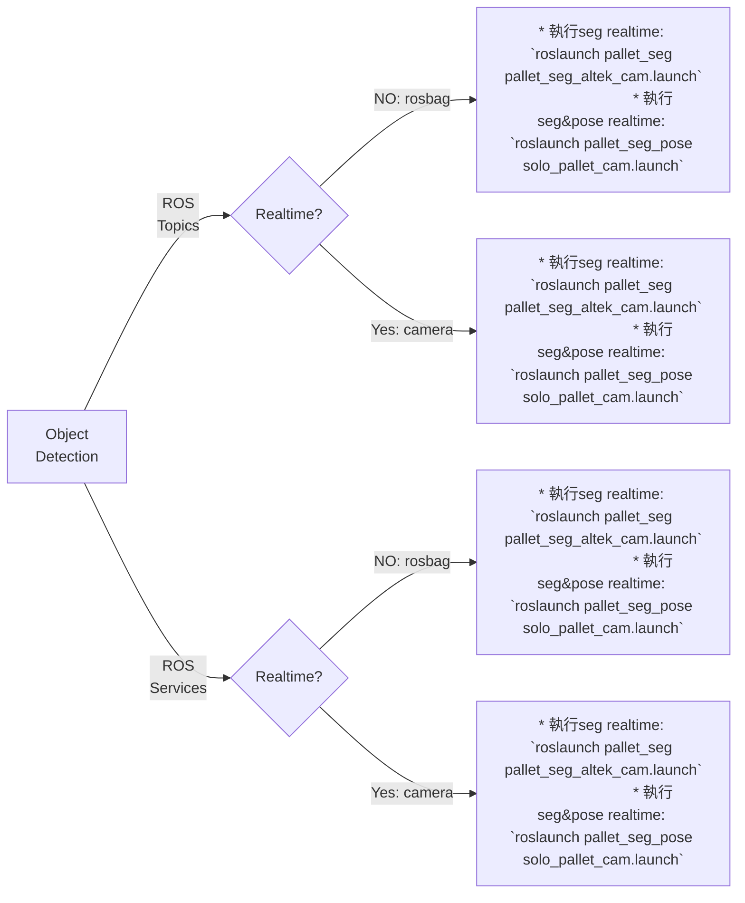

# pallet_det_seg


## Function Modules
| # | <div style="width:250px">Name</div> | rospkg name | Description |
| :----: | :----: | :----: | :----: |
| A1 | 托盤物件偵測 <br> Pallet object detection | pallet_det | Detect wood pallets bounding boxes from RGB image |
| B1 | 托盤點雲提取+姿態估測 <br> Pallet point cloud extraction <br>& pose estimation | pallet_det_pose | Extract 3D points relative to pallet bounding boxes' pixels from organized point cloud and estimate pallet's pose |
| A2 | 托盤物件偵測 <br> Pallet object detection | pallet_det | Detect wood pallets bounding boxes from RGB image |
| B2 | 托盤點雲提取+姿態估測 <br> Pallet point cloud extraction <br>& pose estimation | pallet_det_pose | Extract 3D points relative to pallet bounding boxes' pixels from organized point cloud and estimate pallet's pose |

| # | <div style="width:250px">Name</div> | rospkg name | Description |
| :----: | :----: | :----: | :----: |
| C1 | 托盤實例分割 <br> Pallet instance segmentation | pallet_seg | Detect and perform instance segmentation of wood pallets instance masks from RGB image |
| D1 | 托盤點雲提取+姿態估測 <br> Pallet point cloud extraction <br>& pose estimation | pallet_seg_pose | Extract 3D points relative to DLO instance mask pixels from organized point cloud and estimate pallet's pose |
| C2 | 托盤實例分割 <br> Pallet instance segmentation | pallet_seg | Detect and perform instance segmentation of wood pallets instance masks from RGB image |
| D2 | 托盤點雲提取+姿態估測 <br> Pallet point cloud extraction <br>& pose estimation | pallet_seg_pose | Extract 3D points relative to DLO instance mask pixels from organized point cloud and estimate pallet's pose |

## RGB-D Camera
* [Realsense D435i](https://www.intelrealsense.com/depth-camera-d435i)
    - [ ] How to modify dockerfile
* [Altek 3D UVC](https://store.altek.com.tw/sites/default/downloads/al3d/altek_3D_UVC_Camera_Product_Specification_20220107.pdf)  
    * silver_camera: Altek_3D_Camera SDK (v2.49.0 tag:unknown)
    * black_camera: Altek_3D_Camera SDK (v2.49.0 tag:v67)
    - [ ] How to modify dockerfile

# Main

```
mkdir pallet_det_seg_ws
git clone --recursive https://github.com/AndersonYu7/pallet_det_seg.git src
cd pallet_det_seg_ws/src/docker && ./build.sh
./run.sh
```
inside docker container
```
# install mmdetection
cd ~/work/src/mmdetection2
pip3 install -v -e .

# compile darknet (YOLOv4)
cd ~/work/src/darknet_new
make

# build project
cd ~/work
catkin_make
. devel/setup.bash
```

## 物件偵測
### 下載pallet YOLOv4權重檔
* YOLOv4
* config:
* weights

### 使用預錄ROSBag

| # | <div style="width:250px">Name</div> | ROSbag | Realtime Camera |
| :----: | :----: | :----: | :----: | 
| A1 | 托盤物件偵測 <br> Pallet object detection | roslaunch pallet_seg pallet_seg_altek_cam.launch | roslaunch pallet_seg_pose solo_pallet_cam.launch|
| A1+B1 | 托盤點雲提取+姿態估測 <br> Pallet point cloud extraction <br>& pose estimation | roslaunch pallet_seg pallet_seg_altek_cam.launch | roslaunch pallet_seg_pose solo_pallet_cam.launch|

### 使用即時相機資訊

| # | <div style="width:250px">Name</div> | ROSbag | Realtime Camera |
| :----: | :----: | :----: | :----: | 
| A2 | 托盤物件偵測 <br> Pallet object detection | roslaunch pallet_seg pallet_seg_altek_cam.launch | roslaunch pallet_seg pallet_seg_altek_cam.launch|
| A2+B2 | 托盤點雲提取+姿態估測 <br> Pallet point cloud extraction <br>& pose estimation | roslaunch pallet_seg pallet_seg_altek_cam.launch | roslaunch pallet_seg pallet_seg_altek_cam.launch|

## 實例分割
### 下載pallet SOLOv2權重檔
* SOlOv2 with [mmdetection2](https://github.com/open-mmlab/mmdetection)
* config: ./mmdetection2/configs/solov2/pallet_test_2.py  
* weights: pallet.pth  
(把權重檔放在~/work/src/mmdetection2/work_dirs/pallet.pth)
```
# inside docker container
cd ~/work/src/mmdetection2/
mkdir work_dirs

# copy weight into docker container
docker cp pallet.pth 896ac4d402bb:/home/iclab/work/src/mmdetection2/work_dirs
```
### 使用預錄ROSBag
* 執行seg realtime
`roslaunch pallet_seg pallet_seg_altek_cam.launch`
* 執行seg&pose realtime
`roslaunch pallet_seg_pose solo_pallet_cam.launch`

### 使用即時相機資訊
* 執行seg realtime
`roslaunch pallet_seg pallet_seg_altek_cam.launch`

* 執行seg&pose realtime
`roslaunch pallet_seg_pose solo_pallet_cam.launch`


